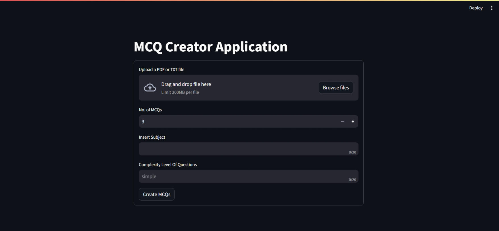
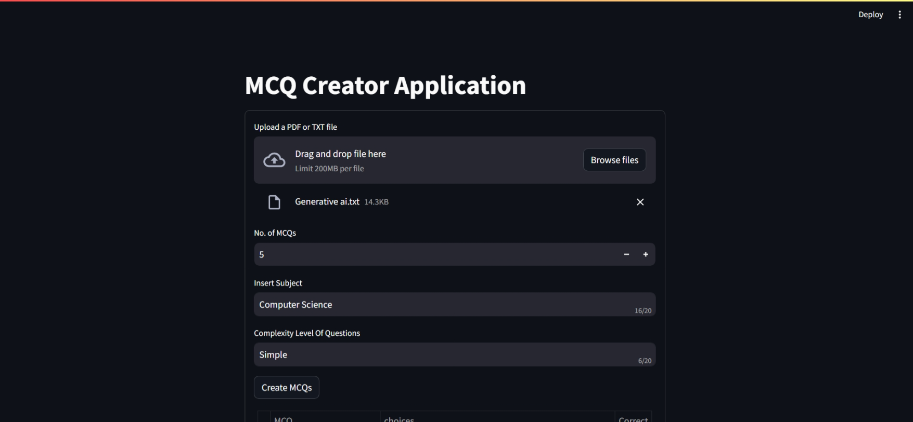
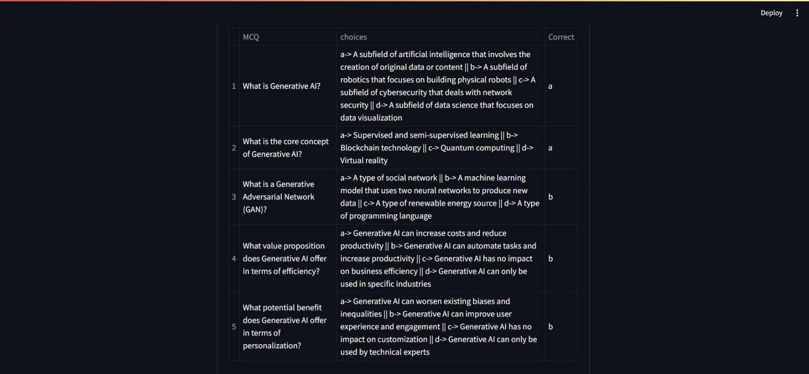

<h1>MCQ Creator Application</h1> 
<b>This project will generate MCQ using openai and langchain</b> 
If you are cloning this repository. Please use your own OPENAI_API_KEY. 
Generate your unique key from:
https://platform.openai.com/api-keys

How to apply OPENAI_API_KEY:
https://platform.openai.com/docs/quickstart?context=python

Best Practices for API Key Safety:
https://help.openai.com/en/articles/5112595-best-practices-for-api-key-safety

App Screenshots:
Web Interface:

Provided inputs:

After Clicking on button Create MCQs:

